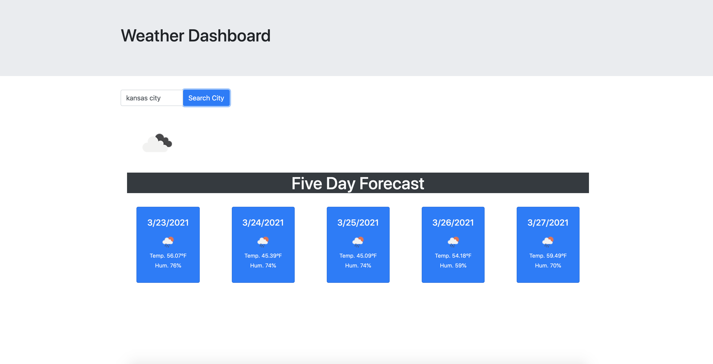

# Weather_API
This application is meant to show the current forecast and the five day forecast of the city that the user searchs for.

The application shows the current temp, humidity, windspeed, and UV.

It stores the users search in the local storage and on the page so the user can see what they have searched for. 
<<<<<<< HEAD
=======

>>>>>>> fc21e9436d8f2ac4d302a787a20c7946280ddf9b
